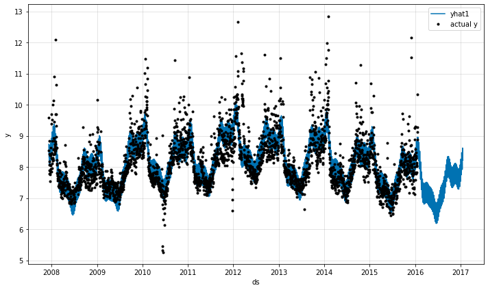

.. NeuralProphet documentation master file, created by
   sphinx-quickstart on Tue Oct 12 13:27:59 2021.
   You can adapt this file completely to your liking, but it should at least
   contain the root `toctree` directive.

=========================================
NeuralProphet - Quick Start
=========================================

Installing
----------

NeuralProphet can be installed with `pip <https://pypi.org/project/neuralprophet/>`_:

.. code-block:: bash

  $ pip install neuralprophet

If you plan to use the package in a Jupyter notebook, we recommend to install the 'live' version:

.. code-block:: bash

  $ pip install neuralprophet[live]

Alternatively, you can get the most up to date version by cloning directly from `GitHub <https://github.com/ourownstory/neural_prophet>`_:

.. code-block:: bash

  $ git clone https://github.com/ourownstory/neural_prophet.git
  $ cd neural_prophet
  $ pip install .

Simple Model 
----------------

The input data should have two columns, :code:`ds` which has the timestamps and :code:`y` column which
contains the observed values of the time series. 

.. code-block:: Python

  from neuralprophet import NeuralProphet
  import pandas as pd

  data_location = "https://raw.githubusercontent.com/ourownstory/neuralprophet-data/main/datasets/"

  df = pd.read_csv(data_location + 'wp_log_peyton_manning.csv') 

To setup a simple NeuralProphet model, create an object of the :code:`NeuralProphet` class as follows and call the fit function. Frequency is automatically detected 😉

.. code-block:: Python

  m = NeuralProphet()
  metrics = m.fit(df)

Now we can simple make predictions using this fitted model by creating a future dataframe and setting the forecast horizon via the functional argument :code:`periods`: 

.. code-block:: Python 

  future = m.make_future_dataframe(df=df, periods=365)
  forecast = m.predict(df=future)

Next, we obtain the forecast and visualize our data... et voila 👩🏼‍🎨

.. code-block:: Python 

  fig_forecast = m.plot(forecast)

Checkout the :ref:`my-reference-label2` description for additional basic features of NeuralProphet. 

.. toctree::
   :hidden:
   :maxdepth: 1

   Full Simple Model<full_simple_model>
   Model Overview<model-overview>
   Changes from Prophet<changes-from-prophet.md>
   Contribution<contribute>

Get started with Tutorials
---------------------------

.. _target:

.. toctree::
   :maxdepth: 1
   :caption: Feature Tutorials

   autoregression_yosemite_temps.nblink
   benchmarking.nblink
   collect_predictions.nblink
   test_and_crossvalidate.nblink
   lagged_covariates_energy_ercot.nblink
   events_holidays_peyton_manning.nblink
   season_multiplicative_air_travel.nblink
   sparse_autoregression_yosemite_temps.nblink
   sub_daily_data_yosemite_temps.nblink
   trend_peyton_manning.nblink
   global_modeling.nblink
   

.. toctree::
   :maxdepth: 1
   :caption: Application Tutorials   

   energy_hospital_load.nblink
   energy_solar_pv.nblink

.. toctree::
   :hidden:
   :maxdepth: 2
   :caption: Code Documentations

   configure.py <configure>
   df_utils.py <df_utils>
   forecaster.py <forecaster>
   hdays.py <hdays>
   metrics.py <metrics>
   plot_forecaster.py <plot_forecast>
   plot_model_parameters.py <plot_model_parameters>
   time_dataset.py <time_dataset>
   time_net.py <time_net>
   utils.py <utils>

